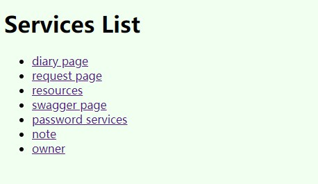
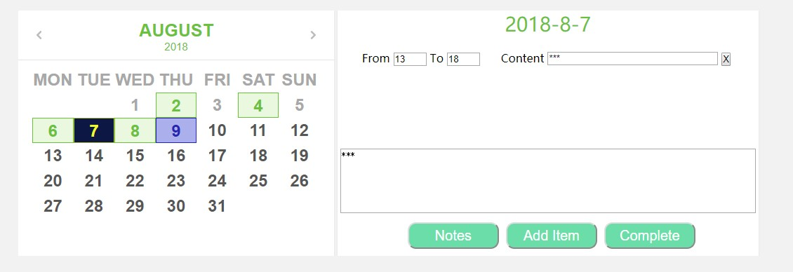
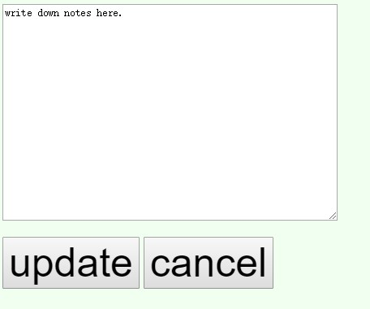

Shane
=====

### Features
- Manage encrypted passwords.
- Record works for time management.
- Back up resources.
- Write down notes.

### Usage

#### Home Page

#### Passwords Page
Use swagger:

#### Diary Page

#### Note Page

#### Resources Path
    /resources

### Notes
No middleware and no database.

Created only based on spring boot and jdk8.

Visit [shaneu.cn](http://shaneu.cn).