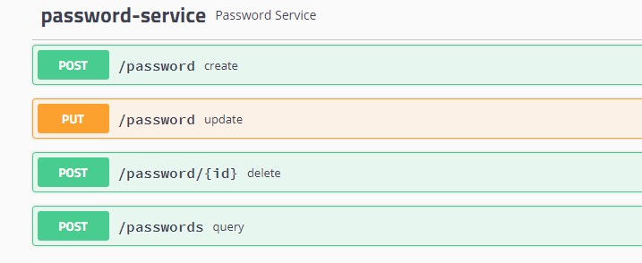

Shane
=====

### Features
- Manage encrypted passwords.
- Record works for time management.
- Back up resources.

### Usage

#### Passwords page
    Use swagger

    Or raw request page(relative path: /main)

#### Diary page

#### Resources path
    /resources

### Notes
    No middleware and no database.
    Created only based on spring boot and jdk8.